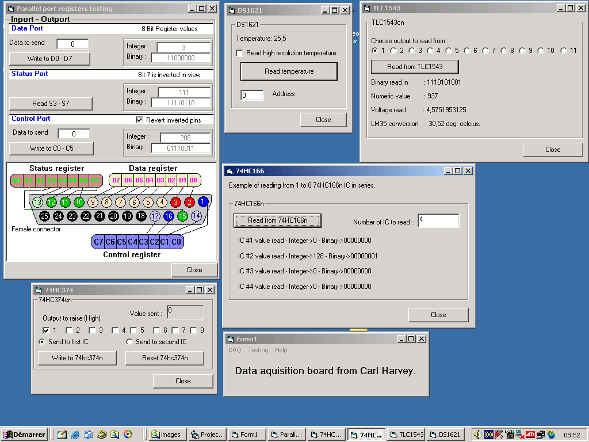

<div align="center">

## DAQ parallel port input/output


</div>

### Description

UPDATE : ADDED : full schematic, photos, instructions. Read/write to parallel port, IC/I2C com, ics are 74hc374-74hc166,tlc1543,ds1621. Real ommunication with electronic chip(IC). My hardware module have 16digital output, 32digital input/output, 11analog input, 1 DS1621 temperature reading IC.

If you need info or help to build a hardware email me. you can get the parts for less that 20$
 
### More Info
 


<span>             |<span>
---                |---
**Submitted On**   |2005-11-20 12:30:04
**By**             |[HarveySolutions](https://github.com/Planet-Source-Code/PSCIndex/blob/master/ByAuthor/harveysolutions.md)
**Level**          |Intermediate
**User Rating**    |4.9 (44 globes from 9 users)
**Compatibility**  |VB 3\.0, VB 4\.0 \(16\-bit\), VB 4\.0 \(32\-bit\), VB 5\.0, VB 6\.0
**Category**       |[Files/ File Controls/ Input/ Output](https://github.com/Planet-Source-Code/PSCIndex/blob/master/ByCategory/files-file-controls-input-output__1-3.md)
**World**          |[Visual Basic](https://github.com/Planet-Source-Code/PSCIndex/blob/master/ByWorld/visual-basic.md)
**Archive File**   |[DAQ\_parall19497911202005\.zip](https://github.com/Planet-Source-Code/harveysolutions-daq-parallel-port-input-output__1-63275/archive/master.zip)

### API Declarations

```
The only needed file is input32.dll
which free on the internet and work on all windows
```


